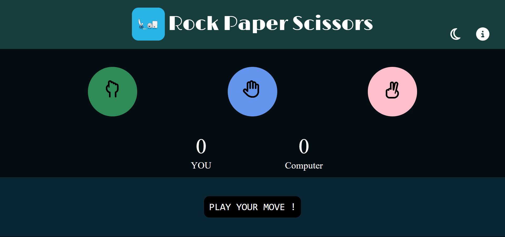
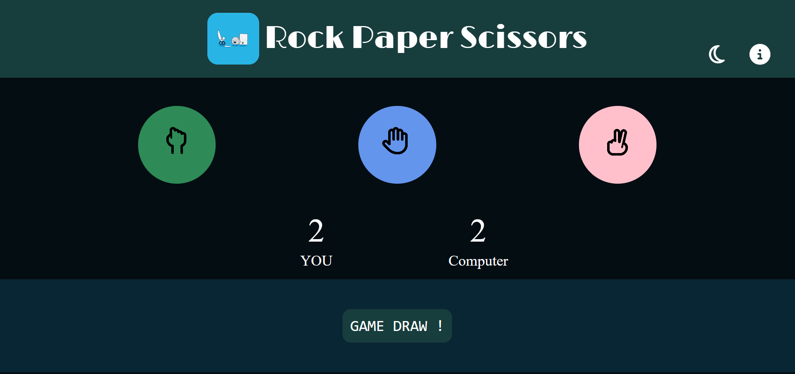
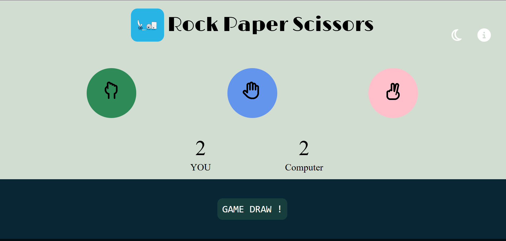
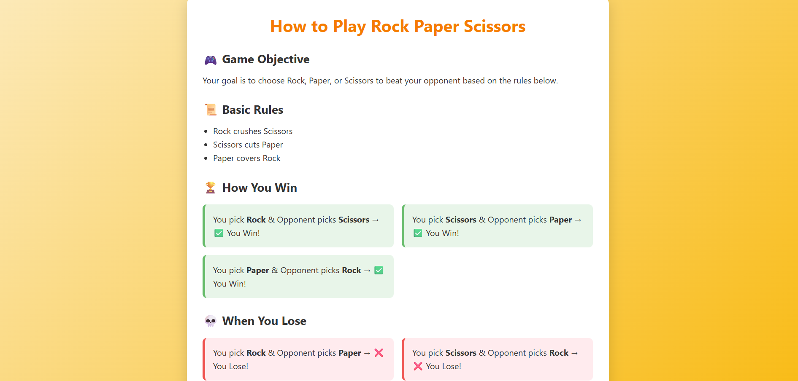

# 🎮 Rock Paper Scissors Game

A simple and interactive Rock Paper Scissors game built using **HTML**, **CSS**, and **JavaScript**. Play against the computer, track your score, and toggle between light and dark themes!

---

## ✨ Features

- 🎲 Play Rock, Paper, Scissors against the computer  
- 📊 Real-time score tracking (You vs Computer)  
- 🎨 Light/Dark theme toggle  
- 🧠 Computer uses `Math.random()` function for random choices  

---

## 📸 Screenshots

### 🖼️ Screenshot 1 – Home Page 


### 🖼️ Screenshot 2 – User vs Computer Scoreboard  


### 🖼️ Screenshot 3 – Light Mode (Theme Change)  


### 🖼️ Screenshot 4 – Instructions Manual  


---

## 🚀 Technologies Used

- HTML5  
- CSS3  
- JavaScript (Vanilla)

---

## 📂 Project Structure
rock-paper-scissors/
│
├── index.html # Game layout
├── style.css # Styling and themes
├── script.js # Game logic
├── instructions.html # Instruction Manual
└── README.md # Project information


---

## ⚙️ How to Run

1. **Clone the repository**:
   ```bash
   git clone https://github.com/Avanti-Chinchone2003/RPS-Showdown.git

2. Open index.html in your browser.

💡 No installations or dependencies required!

💡 Future Improvements (Optional)
Add sound effects

Add animations

📝 Author
Avanti Chinchone